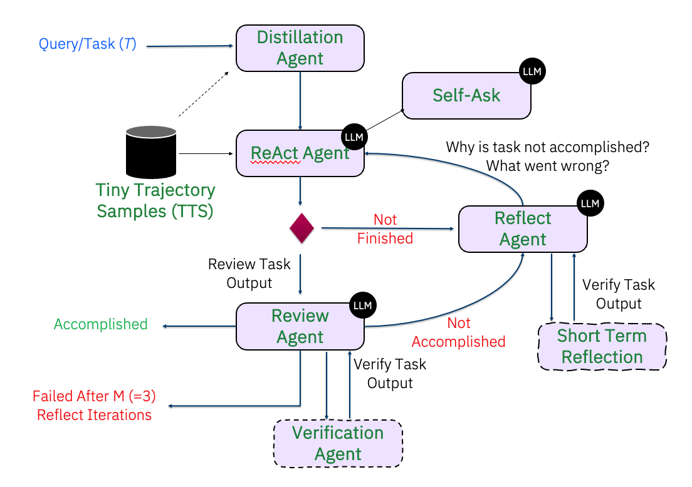

# ReAct eXtENded Agent Design (ReActXen)

[](https://openreview.net/forum?id=luETrQw0j6)
[](https://openreview.net/pdf?id=luETrQw0j6)

This repository contains the implementation of the **ReActXen** framework, focused on agent-based design and interaction.  
It has been referred to as **ReAct++**, **Enhanced ReAct**, etc.

📘 [Tutorial PDF](./docs/tutorial/ReActXen_IoT_Agent_EMNLP_2025.pdf)

---

## 📄 Publication

Our work has been accepted at **[EMNLP 2025 Industry Track](https://openreview.net/forum?id=luETrQw0j6)** 🎉  

> **ReAct Meets Industrial IoT: Language Agents for Data Access**  
> *James T. Rayfield, Shuxin Lin, Nianjun Zhou, Dhaval C. Patel*  

📑 [Read the Paper (OpenReview PDF)](https://openreview.net/pdf?id=luETrQw0j6)

### Citation
If you use this work, please cite:
```bibtex
@inproceedings{patel2025react,
  title     = {ReAct Meets Industrial IoT: Language Agents for Data Access},
  author    = {James T. Rayfield and Shuxin Lin and Nianjun Zhou and Dhaval C. Patel},
  booktitle = {Proceedings of the 2025 Conference on Empirical Methods in Natural Language Processing: Industry Track},
  year      = {2025},
  url       = {https://openreview.net/forum?id=luETrQw0j6}
}
```

### Overview

The **ReActXen** framework is built on the **Agent-Family** that has multiple helper agents as outlined in the following diagram. The ReAct agent supports both **text generation** and **code generation** based on the specified action. 

<div style="text-align: center;">
  
</div>

## Table of Contents

- [Project Setup Instructions](#project-setup-instructions)
- [Setting Up the LLM](#getting-ready-to-use-reactxen)
- [Getting Ready to use ReActXen](#getting-ready-to-use-reactxen)
- [Hello Word ReActXen](#hello-world-reactxen)
- [API Functions](#api-functions)
- [Publications](#publications)

## Project Setup Instructions

To get started with this project, follow these steps:

1. **Clone the repository**:
    ```bash
    git clone git@github.ibm.com:GenAIApps/ReActXen.git
    cd reactxen
    ```

2. **Set up a Python virtual environment (Python 3.11 or greater is required)**:
    ```bash
    python3.11 -m venv reactxen
    source reactxen/bin/activate  # On macOS/Linux
    # .\\reactxen\\Scripts\\activate  # On Windows
    ```

3. **Install the required dependencies**:
    Simply run the following command to install the package and its dependencies:
    ```bash
    pip install .
    ```

4. If you need to clean or remove the Python virtual environment (`reactxen`), follow these steps:

    ```bash
    deactivate
    rm -rf reactxen
    ```

## Getting Ready to use ReActXen

1. Setting Up Environment Variables. Copy the `.env_template` file to `.env`:
   ```bash
   cp env/.env_template .env
   ```

2. Edit the .env file and replace the placeholders with your actual values:

    ```bash
    WATSONX_APIKEY=your_watsonx_apikey
    WATSONX_URL=https://your-watsonx-url.com
    WATSONX_PROJECT_ID=your_project_id
    ```

## Hello World ReActXen

In the **hello_world_math.py** demo, the ReActXen framework is used to solve the following mathematical equation:

**Question:** Find the \(r\) that satisfies the equation:

  \[
  \log_{16} (r+16) = \frac{5}{4}
  \]

The question asks the agent to find the value of \(r\) that satisfies the logarithmic equation.

1. Execute the demo script (id 15 = granite 3.2, ibm/granite-3-2-8b-instruct)

    ```bash
    cd src/reactxen/demo
    python hello_world_math.py --mode code --model_id 15 # for code model
    python hello_world_math.py --mode text --model_id 15 # for text model
    ```

## API Functions

- **`create_reactxen_agent`**  
  *Description*: Initializes and configures a ReActXen agent.  
  *Example Usage*:  
  ```python
  agent = create_reactxen_agent(question="Find the r...", key="", ...)
  ```

- **`run_reactxen_agent`**
  *Description*: Runs the agent and returns the result.
  *Example Usage*:
  ```python
  agent.run()
  ```
  You can view the review agent output here: [Review](./src/reactxen/resources/sample_review_math_problem.json)

- **`export_benchmark_metric`**
  *Description*: Exports benchmark metrics from the agent's run.
  *Example Usage*:
  ```python
  agent.export_benchmark_metric()
  ```

  You can view the benchmark metric here: [Benchmark](./src/reactxen/resources/sample_metric_math_problem.json)

- **`export_trajectory`**
  *Description*: Exports the trajectory of the agent's decisions.
  *Example Usage*:
  ```python
  agent.export_trajectory()
  ```

  You can view the sample exported trajectory here: [Trajectory](./src/reactxen/resources/sample_traj_math_problem.json)
