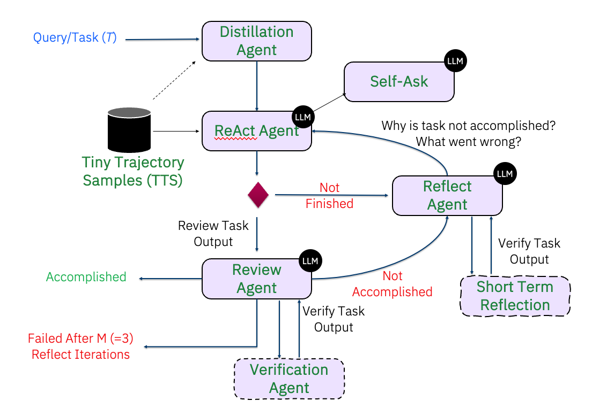

# ReAct eXtENded Agent Design (ReActXen)

[](https://openreview.net/forum?id=luETrQw0j6)
[](https://openreview.net/pdf?id=luETrQw0j6)

This repository contains the implementation of the **ReActXen** framework, focused on agent-based design and interaction.  
It has been referred to as **ReAct++**, **Enhanced ReAct**, etc.

The current version is 0.0.8. This uses python = ">=3.12,<3.14" and langchain = "^1.1.0".

The previous version is tagged `0.0.7`


📘 [Tutorial PDF](./docs/tutorial/ReActXen_IoT_Agent_EMNLP_2025.pdf)

---

## 📄 Publication

Our work has been accepted at **[EMNLP 2025 Industry Track](https://openreview.net/forum?id=luETrQw0j6)** 🎉  

> **ReAct Meets Industrial IoT: Language Agents for Data Access**  
> *James T. Rayfield, Shuxin Lin, Nianjun Zhou, Dhaval C. Patel*  

📑 [Read the Paper (OpenReview PDF)](https://openreview.net/pdf?id=luETrQw0j6)

### Citation
If you use this work, please cite:
```bibtex
@inproceedings{patel2025react,
  title     = {ReAct Meets Industrial IoT: Language Agents for Data Access},
  author    = {James T. Rayfield and Shuxin Lin and Nianjun Zhou and Dhaval C. Patel},
  booktitle = {Proceedings of the 2025 Conference on Empirical Methods in Natural Language Processing: Industry Track},
  year      = {2025},
  url       = {https://openreview.net/forum?id=luETrQw0j6}
}
```

### Overview

The **ReActXen** framework is built on the **Agent-Family** that has multiple helper agents as outlined in the following diagram. The ReAct agent supports both **text generation** and **code generation** based on the specified action. 

<div style="text-align: center;">
  
</div>

## Table of Contents

- [Project Setup Instructions](#project-setup-instructions)
- [Setting Up the LLM](#getting-ready-to-use-reactxen)
- [Getting Ready to use ReActXen](#getting-ready-to-use-reactxen)
- [Hello Word ReActXen](#hello-world-reactxen)
- [API Functions](#api-functions)
- [Publications](#publications)

## Project Setup Instructions

To get started with this project, follow these steps:

1. **Clone the repository**:
    ```bash
    git clone git@github.ibm.com:GenAIApps/ReActXen.git
    cd reactxen
    ```

2. **Set up a Python virtual environment (Python 3.11 or greater is required)**:
    ```bash
    python3.11 -m venv reactxen
    source reactxen/bin/activate  # On macOS/Linux
    # .\\reactxen\\Scripts\\activate  # On Windows
    ```

3. **Install the required dependencies**:
    Simply run the following command to install the package and its dependencies:
    ```bash
    pip install .
    ```

4. If you need to clean or remove the Python virtual environment (`reactxen`), follow these steps:

    ```bash
    deactivate
    rm -rf reactxen
    ```

## Getting Ready to use ReActXen

1. Setting Up Environment Variables. Copy the `.env_template` file to `.env`:
   ```bash
   cp env/.env_template .env
   ```

2. Edit the .env file and replace the placeholders with your actual values:

    ```bash
    WATSONX_APIKEY=your_watsonx_apikey
    WATSONX_URL=https://your-watsonx-url.com
    WATSONX_PROJECT_ID=your_project_id
    ```

## Hello World ReActXen

In the **hello_world_math.py** demo, the ReActXen framework is used to solve the following mathematical equation:

**Question:** Find the \(r\) that satisfies the equation:

  \[
  \log_{16} (r+16) = \frac{5}{4}
  \]

The question asks the agent to find the value of \(r\) that satisfies the logarithmic equation.

1. Execute the demo script (id 15 = granite 3.2, ibm/granite-3-2-8b-instruct)

    ```bash
    cd src/reactxen/demo
    python hello_world_math.py --mode code --model_id 15 # for code model
    python hello_world_math.py --mode text --model_id 15 # for text model
    ```

## API Functions

- **`create_reactxen_agent`**  
  *Description*: Initializes and configures a ReActXen agent.  
  *Example Usage*:  
  ```python
  agent = create_reactxen_agent(question="Find the r...", key="", ...)
  ```

- **`run_reactxen_agent`**
  *Description*: Runs the agent and returns the result.
  *Example Usage*:
  ```python
  agent.run()
  ```
  You can view the review agent output here: [Review](./src/reactxen/resources/sample_review_math_problem.json)

- **`export_benchmark_metric`**
  *Description*: Exports benchmark metrics from the agent's run.
  *Example Usage*:
  ```python
  agent.export_benchmark_metric()
  ```

  You can view the benchmark metric here: [Benchmark](./src/reactxen/resources/sample_metric_math_problem.json)

- **`export_trajectory`**
  *Description*: Exports the trajectory of the agent's decisions.
  *Example Usage*:
  ```python
  agent.export_trajectory()
  ```

  You can view the sample exported trajectory here: [Trajectory](./src/reactxen/resources/sample_traj_math_problem.json)

  ---

  # Running Experiments

> **Before running anything**, navigate to the following directory:
> ```
> src/reactxen/agents/factly/agent
> ```

---

## Running Research Question 1

For more information, see `docs/credit_assignment_algorithms.md` and `docs/prompt_optimizer_benchmark.md` at the root of the project.

### Running `credit_assignment.py`

```bash
python credit_assignment.py semantic
python credit_assignment.py lexical
```

Results will be saved in the `credit_assignment_results` folder.

---

### Running `benchmark_credit_assignment.py`

```bash
python benchmark_credit_assignment.py --traj_dir ../traj_store --csv_dir . --output_dir benchmark_outputs
```

---

## Running Research Question 2

For more information, see `docs/prompt_optimizer_benchmark.md` at the root of the project.

```bash
python benchmark_prompt_optimizers.py --n 5 --methods baseline,v1
```

---

## Running Research Question 3

For more information, see `docs/prompt_optimizer_benchmark.md` at the root of the project.

```bash
python benchmark_prompt_optimizers.py --n 5 --methods v1,v2_lexical,v2_semantic

---

# Troubleshooting Guide

## Table of Contents

- [Installation & Setup](#installation--setup-1)
- [Environment Variables & API Keys](#environment-variables--api-keys)
- [Model & API Errors](#model--api-errors)
- [Agent Runtime Errors](#agent-runtime-errors)
- [Context Length Overflow](#context-length-overflow)
- [Tool Cache Issues](#tool-cache-issues)
- [Running Experiments (Factly)](#running-experiments-factly-1)
- [Python Version & Dependency Conflicts](#python-version--dependency-conflicts)

---

## Installation & Setup

### `pip install .` fails

**Symptoms:** Dependency resolution errors, build errors, or version conflicts.

**Fixes:**
- Confirm you are using Python 3.12 or 3.13 (required by `pyproject.toml`):
  ```bash
  python --version
  ```
- If using Poetry directly, make sure Poetry is up to date:
  ```bash
  pip install --upgrade poetry
  poetry install
  ```
- If you see `setuptools` errors, upgrade it first:
  ```bash
  pip install --upgrade setuptools
  ```

---

### Virtual environment is broken or missing

**Symptoms:** `ModuleNotFoundError: No module named 'reactxen'`, commands not found.

**Fix:** Recreate the virtual environment:
```bash
deactivate
rm -rf reactxen
python3.12 -m venv reactxen
source reactxen/bin/activate   # macOS/Linux
# .\reactxen\Scripts\activate  # Windows
pip install .
```

---

### `ModuleNotFoundError` after install

**Symptom:** `ModuleNotFoundError: No module named 'reactxen'` even after `pip install .`

**Fix:** Make sure you installed from the repo root (where `pyproject.toml` lives), not from inside `src/`:
```bash
cd /path/to/ReActXen
pip install .
```

---

## Environment Variables & API Keys

### `.env` file not found or not loaded

**Symptom:** `KeyError` or empty string for `WATSONX_APIKEY`, `WATSONX_URL`, etc.

**Fix:**
1. Copy the template and fill in your credentials:
   ```bash
   cp env/.env_template .env
   ```
2. Edit `.env` at the **project root** (not inside `env/`):
   ```
   WATSONX_APIKEY="your_actual_key"
   WATSONX_URL="https://your-watsonx-url.com"
   WATSONX_PROJECT_ID="your_project_id"
   ```
3. The code calls `load_dotenv()` which reads `.env` from the current working directory. Always run scripts from the project root, or pass `load_dotenv(dotenv_path="path/to/.env")` explicitly.

---

### WatsonX credentials rejected

**Symptom:** `ApiRequestFailure: 401 Unauthorized` or `403 Forbidden`.

**Checklist:**
- Verify the API key is active in IBM Cloud.
- Confirm `WATSONX_URL` ends without a trailing slash (e.g., `https://us-south.ml.cloud.ibm.com`).
- Confirm `WATSONX_PROJECT_ID` is the correct project UUID.

---

### LiteLLM API key / base URL issues

**Symptom:** `AuthenticationError` or connection refused when using LiteLLM model IDs (24–37, 51–54).

**Fix:**
Ensure `LITELLM_API_KEY` and `LITELLM_BASE_URL` are set in `.env`:
```
LITELLM_API_KEY="your_litellm_key"
LITELLM_BASE_URL="https://your-litellm-proxy"
```

---

## Model & API Errors

### `ValueError: Invalid model_id` or `IndexError: Invalid model_id`

**Symptom:** Error when passing a model ID integer to `create_reactxen_agent`.

**Fix:** Valid IDs are `0–55` as of v0.0.13. See `src/reactxen/utils/model_inference.py` for the full list. Example:
```python
agent = create_reactxen_agent(..., react_llm_model_id=15)  # ibm/granite-3-2-8b-instruct
```

---

### API call hangs indefinitely

**Symptom:** Script runs forever with no output.

**Fixes:**
- Set a `max_steps` limit (default is 6) to cap the agent loop.
- Enable `early_stop=True` to let the agent exit when it detects completion.
- Check network connectivity to the WatsonX/LiteLLM endpoint.

---

### `ApiRequestFailure` — token limit exceeded

**Symptom:** Error message matching `cannot exceed the total tokens limit` or `context length`.

**Fix:** Enable context overflow handling:
```python
agent = create_reactxen_agent(
    ...,
    handle_context_length_overflow=True,
)
```
Alternatively, reduce `max_steps` or shorten the question/tool descriptions.

---

## Agent Runtime Errors

### Agent loops on the same action

**Symptom:** The agent repeats the same `Thought → Action → Observation` cycle without progressing.

**Fix:** Enable loop detection:
```python
agent = create_reactxen_agent(
    ...,
    apply_loop_detection_check=True,
)
```

---

### `KeyError` or `AttributeError` when using tools

**Symptom:** Crash inside a tool call during the agent run.

**Checklist:**
- All tools passed to `tools=` must be valid `BaseTool` subclasses.
- `tool_names` and `tool_desc` must match the actual tools provided.
- Tool function signatures must match the parameters the agent generates.

---

### Code blocks not parsed / executed

**Symptom:** Agent generates Python code but it is not executed, or output is malformed.

**Fix:** Set `actionstyle` to match your intended mode:
```python
agent = create_reactxen_agent(..., actionstyle="Code")  # code generation
agent = create_reactxen_agent(..., actionstyle="Text")  # text-based tool calls
```

---

### Chat template errors with Granite models

**Symptom:** Malformed prompts or unexpected tokens with Granite models.

**Fix:**
```python
agent = create_reactxen_agent(..., apply_chat_template=True)
```

---

## Context Length Overflow

| Model | Context Window |
|---|---|
| `ibm/granite-13b-chat-v2` (id 1) | 4,096 tokens |
| `ibm/granite-3-8b-instruct` (id 8) | 128,000 tokens |
| `ibm/granite-3-2-8b-instruct` (id 15) | 128,000 tokens |
| `openai/gpt-4o` (id 5) | 16,384 tokens |
| `meta-llama/llama-4-maverick` (id 16) | 10,000,000 tokens |

**Strategies to reduce token usage:**
- Lower `max_steps` (e.g., `max_steps=3`).
- Use `handle_context_length_overflow=True` to auto-trim the scratchpad.
- Switch to a model with a larger context window.
- Shorten or simplify `tool_desc`.

---

## Tool Cache Issues

### Stale cache returning wrong results

**Symptom:** Agent returns outdated observations from a previous run.

**Fix:** Clear the cache file at the project root:
```bash
rm tool_cache.json
```
Or clear it programmatically:
```python
from reactxen.utils.tool_cache import ToolInvocationCache
cache = ToolInvocationCache()
cache.clear_cache()
```

---

### Cache file permission error

**Symptom:** `FileNotFoundError` or `PermissionError` when writing `tool_cache.json`.

**Fix:** The cache is written to the current working directory when the script runs. Ensure you have write permission there, or run from the project root.

---

## Running Experiments (Factly)

### `ModuleNotFoundError` when running experiment scripts

**Symptom:** Errors importing `reactxen` when running scripts under `src/reactxen/agents/factly/agent/`.

**Fix:** Make sure your virtual environment is active and the package is installed:
```bash
source reactxen/bin/activate
pip install .
cd src/reactxen/agents/factly/agent
python credit_assignment.py semantic
```

---

### `benchmark_credit_assignment.py` — trajectory directory not found

**Symptom:** `FileNotFoundError` for `--traj_dir`.

**Fix:** Generate trajectories by running the agent first, then run the benchmark. Create `traj_store` if it does not exist:
```bash
mkdir -p src/reactxen/agents/factly/agent/traj_store
python benchmark_credit_assignment.py --traj_dir ../traj_store --csv_dir . --output_dir benchmark_outputs
```

---

### `benchmark_prompt_optimizers.py` — unknown method

**Symptom:** `ValueError` or `KeyError` for an unrecognized method name.

**Fix:** Valid method values are `baseline`, `v1`, `v2_lexical`, `v2_semantic`:
```bash
python benchmark_prompt_optimizers.py --n 5 --methods baseline,v1
python benchmark_prompt_optimizers.py --n 5 --methods v1,v2_lexical,v2_semantic
```

---

## Python Version & Dependency Conflicts

### `langchain` version conflict

**Symptom:** Import errors or `AttributeError` on `langchain` objects.

**Fix:** This project requires `langchain ^1.1.0`. Check and upgrade if needed:
```bash
pip show langchain
pip install --upgrade langchain
```

---

### `diffusers` version pinned

**Note:** `diffusers==0.34.0` is pinned in `pyproject.toml`. Do not upgrade it without testing.

---

### Pre-commit hooks failing

**Symptom:** `pre-commit` blocks commits with `ruff` or `black` formatting errors.

**Fix:**
```bash
black src/
ruff check src/ --fix
git add -u
git commit -m "your message"
```

---

## Still Stuck?

1. Run with `debug=True` (default) in `create_reactxen_agent` to see verbose agent output.
2. Compare against the sample outputs in `src/reactxen/resources/`.
3. Review the `docs/` folder for algorithm and benchmark documentation.
```

---

# Project Source Code

Please find the codes that we created and modified in this directory:

```
src/reactxen/agents/factly/agent/
```

Below is a summary of every file we created or modified for this project.

## Core Agent Code

| File | Status | Description |
|---|---|---|
| `truthful_mcqa_checker.py` | Modified | Main Factly agent — runs TruthfulQA fact-checking with ReActXen. Contains `PROMPT_OG` (baseline prompt) and the full agent execution pipeline. |
| `truthful_mcqa_checker_demo.py` | Created | Interactive Streamlit demo for side-by-side prompt comparison and credit assignment benchmark visualization. |

## Credit Assignment (RQ1)

| File | Status | Description |
|---|---|---|
| `credit_assignment.py` | Created | Assigns per-step credit to agent trajectories using either lexical (ROUGE-L / Jaccard) or semantic (embedding cosine similarity) scoring. |
| `benchmark_credit_assignment.py` | Created | Benchmarks lexical vs semantic credit assignment — computes concentration metrics, ablation degradation, and generates comparison outputs. |
| `evaluation/__init__.py` | Created | Package init for the evaluation sub-module. |
| `evaluation/credit_metrics.py` | Created | Mathematical metric functions: entropy, Gini coefficient, Top-K mass, effective number of steps, correlation, cosine similarity, and Jensen-Shannon divergence. |
| `evaluation/ablation.py` | Created | Ablation evaluation — removes Top-k credited steps and measures degradation in similarity to the final answer; computes AUC via the trapezoidal rule. |
| `evaluation/plotting.py` | Created | Visualization utilities for credit distributions, tool credit bar charts, and ablation curves. |

## Prompt Optimization (RQ2 & RQ3)

| File | Status | Description |
|---|---|---|
| `prompt_optimizer.py` | Created | V1 (Behavioral) prompt optimizer — iteratively refines the system prompt by analyzing agent trajectories and extracting behavioral rules. |
| `prompt_optimizer_v2.py` | Created | V2 (Lexical) prompt optimizer — uses ROUGE-L / Jaccard credit assignment to guide prompt refinement. |
| `prompt_optimizer_v2_semantic.py` | Created | V2 (Semantic) prompt optimizer — uses embedding-based credit assignment to guide prompt refinement. |
| `benchmark_prompt_optimizers.py` | Created | Benchmarks optimized prompts on unseen TruthfulQA questions — computes success rate, groundedness, fault rate, and composite score. |

---

# Pre-Computed Results

All experiment outputs are committed to the repository so results can be inspected without re-running the scripts.

## Credit Assignment Results (RQ1)

| File / Folder | Description |
|---|---|
| `src/reactxen/agents/factly/agent/credit_assigned_steps.csv` | Per-step credit scores (lexical & semantic) for every trajectory |
| `src/reactxen/agents/factly/agent/tool_credit_summary_with_filenames.csv` | Aggregated credit per tool type |
| `src/reactxen/agents/factly/agent/credit_assignment_results/` | Per-trajectory credit distribution plots |
| `src/reactxen/agents/factly/traj_store/` | Raw trajectory JSON files used as input |

## Credit Assignment Benchmark Results (RQ1)

All outputs from `benchmark_credit_assignment.py` are stored in:

```
src/reactxen/agents/factly/agent/benchmark_outputs/
```

| File | Description |
|---|---|
| `benchmark_summary.json` | Lexical vs Semantic summary metrics (entropy, Gini, Top-K mass, ablation AUC) |
| `per_step_credit_comparison.csv` | Side-by-side lexical and semantic credit for every step |
| `per_tool_credit_comparison.csv` | Per-tool credit distribution comparison |
| `ablation_results.csv` | Degradation values at each Top-k removal level |
| `ablation_curves.png` | Ablation degradation curves (lexical vs semantic) |
| `credit_distribution_plots.png` | Histogram of credit score distributions |
| `tool_credit_distribution_plots.png` | Bar chart of credit allocated to each tool |
| `human_eval_sample.csv` | Sampled steps for optional human evaluation |

## Prompt Optimizer Benchmark Results (RQ2 & RQ3)

| File | Description |
|---|---|
| `benchmark_outputs/prompt_benchmark_summary.json` | Rankings for V1, V2_Lexical, V2_Semantic (n=5) |
| `benchmark_outputs/prompt_benchmark_summary_n=5_baseline_v1.json` | Baseline vs V1 comparison (n=5) |
| `benchmark_outputs/prompt benchmark results (n5)/prompt_benchmark_summary.json` | Earlier benchmark run with 3 optimizers |

## Optimized Prompts

The final system prompts produced by each optimizer are stored under `genai-proj-results/`:

| Folder | Optimizer | Contents |
|---|---|---|
| `genai-proj-results/prompt_optimizer_v1/` | V1 (Behavioral) | `system_prompt.txt`, per-loop trajectories |
| `genai-proj-results/prompt_optimizer_v2_default/` | V2 (Lexical) | `system_prompt.txt`, per-loop trajectories |
| `genai-proj-results/prompt_optimizer_v2_semantic/` | V2 (Semantic) | `system_prompt.txt`, per-loop trajectories |

Each folder contains loop subdirectories (`loop_1/`, `loop_2/`, …) with the trajectory outputs and meta-analysis prompts from that optimization iteration, as well as intermediate `system_prompt_loop_*.txt` snapshots.

## Documentation

| File | Description |
|---|---|
| `docs/credit_assignment_algorithms.md` | Detailed explanation of the credit assignment algorithms |
| `docs/prompt_optimizer_benchmark.md` | Methodology and metrics for the prompt optimizer benchmark |
| `docs/workflow_explanation.md` | End-to-end workflow and evaluation methodology |


